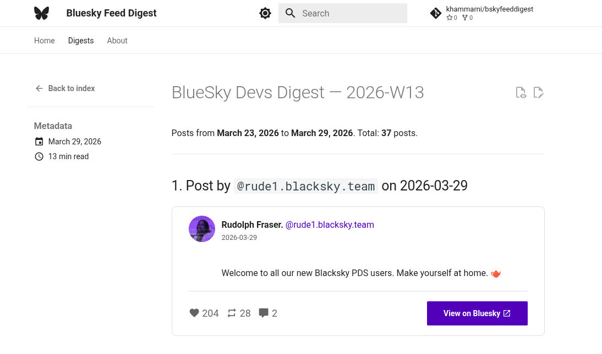
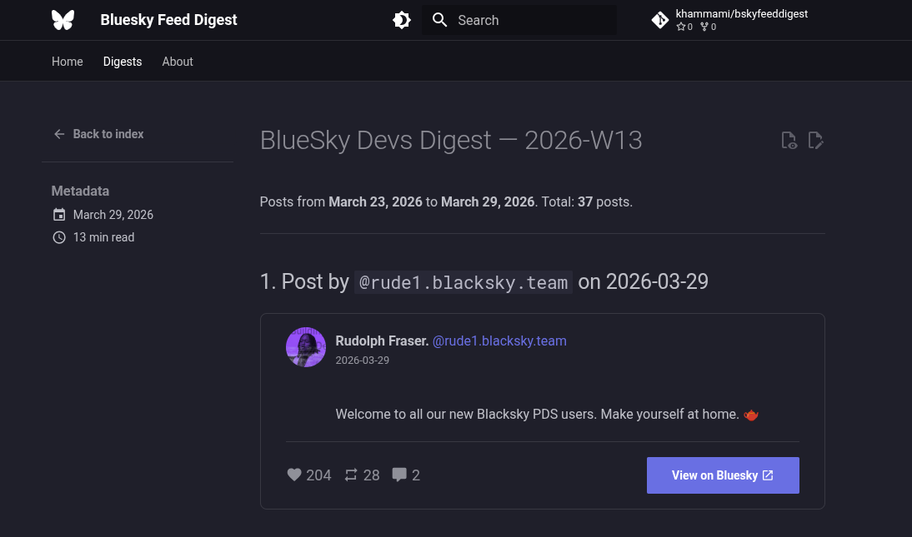

# Bluesky Feed Digest

Automated weekly digest of any Bluesky feed, built with Python and [Zensical](https://zensical.org) (by the Material for MkDocs team), deployed to GitHub Pages.





## Features

- **Generic** — works with any public Bluesky feed URI; optional auth for private feeds
- **Automated** — GitHub Actions runs weekly (configurable cron), with manual trigger support
- **Archive** — every digest is preserved with paginated archive browsing
- **Mobile-friendly** — Zensical/Material theme with responsive design, light/dark mode

## Quick start

### 1. Configure your feed

Edit [`config.yml`](config.yml):

```yaml
feed_uri: "at://did:plc:.../app.bsky.feed.generator/your.feed"
feed_name: "Your Feed Name"
period_days: 7
auth_required: false
```

### 2. Run locally

```bash
python3 -m venv .venv && source .venv/bin/activate
pip install -r scripts/requirements.txt
pip install mkdocs-material

# Generate the digest
cd scripts && python fetch_digest.py && cd ..

# Preview the site
mkdocs serve # add --livereload for auto-reload on changes

# Build the static site (output in site/)
mkdocs build
```

### 3. Deploy via GitHub Actions

1. Push this repo to GitHub
2. Go to **Settings → Pages** and set source to **GitHub Actions**
3. (Optional) If `auth_required: true`, add `BLUESKY_HANDLE` and `BLUESKY_APP_PASSWORD` as repository secrets
4. The workflow runs every Monday at 08:00 UTC, or trigger it manually from the **Actions** tab

## Project structure

```console
├── config.yml                  # Feed configuration (edit this)
├── mkdocs.yml               # Site configuration
├── scripts/
│   ├── fetch_digest.py         # Fetches feed & generates digest
│   └── requirements.txt        # Python dependencies
├── docs/
│   ├── index.md                # Homepage (auto-generated)
│   ├── about.md                # About page (edit this)
│   └── stylesheets/extra.css   # Custom styling
├── data/
│   └── digests.json            # Digest metadata index
└── .github/workflows/
    └── digest.yml              # CI/CD workflow
    └── dependabot.yml          # Dependency updates
```

## Configuration reference

| Key | Default | Description |
|-----|---------|-------------|
| `feed_uri` | — | AT URI of the Bluesky feed (required) |
| `feed_name` | `"Bluesky Feed"` | Display name |
| `period_days` | `7` | Days to look back |
| `min_post_length` | `50` | Skip posts shorter than this |
| `auth_required` | `false` | Set `true` for private feeds |

## License

MIT
